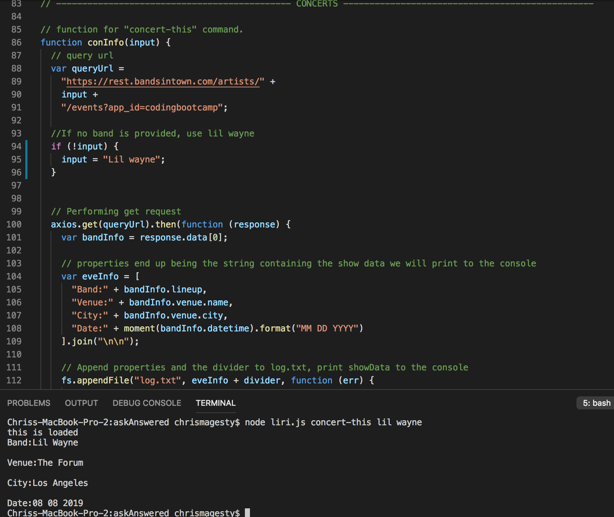
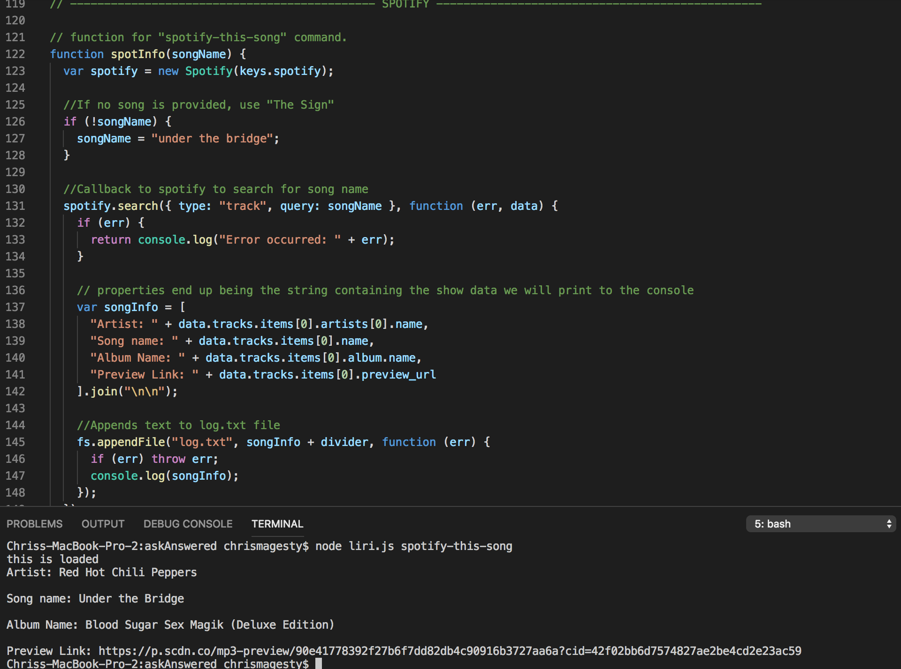
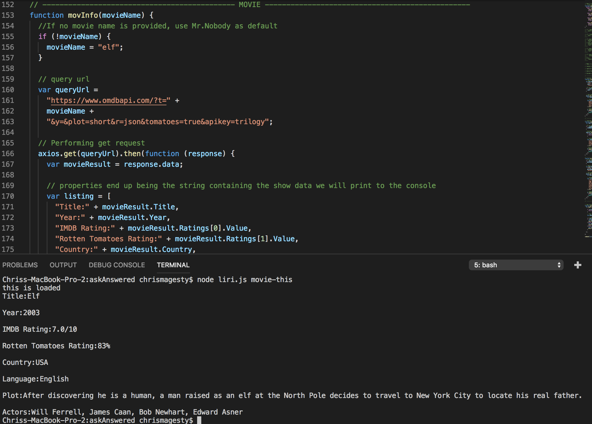
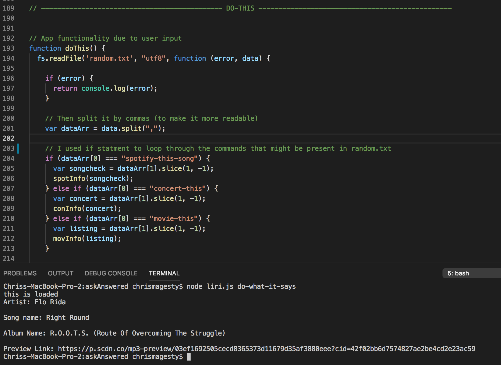

# ask-Answered

## Tech Used

This is a CLI app which uses Javascript and requires the installation of Axios, Moment and the Spotify API.

LIRI will be a command line node app that takes in parameters and gives back data. LIRI can take in the parameter of "Concert-This", "Spotify-This Song", "Movie-This", and "Do-what-it-says" to acquire information about concerts, spotify and the Online Movie Database and reading a "random.txt. See screenshots for further information

### "Concert-this"

   * This will search the Bands in Town Artist Events API for an artist and render the following information about each event to the terminal:

     * Name of the venue

     * Venue location

     * Date of the Event (use moment to format this as "MM/DD/YYYY")

### "Spotify-This-Song"

   * This will show the following information about the song in your terminal/bash window

     * Artist(s)

     * The song's name

     * A preview link of the song from Spotify

     * The album that the song is from

   * If no song is provided then your program will default to "Under the Bridge" by Red Hot Chili Peppers.

   * I have utilized the [node-spotify-api](https://www.npmjs.com/package/node-spotify-api) package in order to retrieve song information from the Spotify API.

### "Movie-This"

   * This will output the following information to your terminal/bash window utilizing axios package:

    
       * Title of the movie.
       * Year the movie came out.
       * IMDB Rating of the movie.
       * Rotten Tomatoes Rating of the movie.
       * Country where the movie was produced.
       * Language of the movie.
       * Plot of the movie.
       * Actors in the movie.
    

   * If the user doesn't type a movie in, the program will output data for the movie 'Elf'

### "Do-What-It-Says"

   * Using the `fs` Node package, LIRI will take the text inside of random.txt and then use it to call one of LIRI's commands.

     * It should run `spotify-this-song` for "I Want it That Way," as follows the text in `random.txt`.

     * Edit the text in random.txt to test out the feature for movie-this and concert-this.
     

